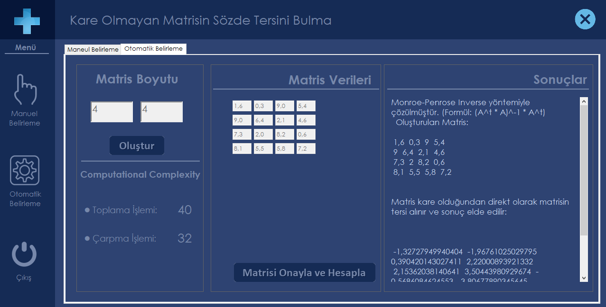

# Pseudo Matrix Inverse Calculation Program

## A program for calculating Pseudo Matrix Inverse with GUI

### Description:

  - Manuel dimension settings
  
  - Random dimension with random values
  
  - Calculating Inverse of Matrix using Moore-Penrose
  

